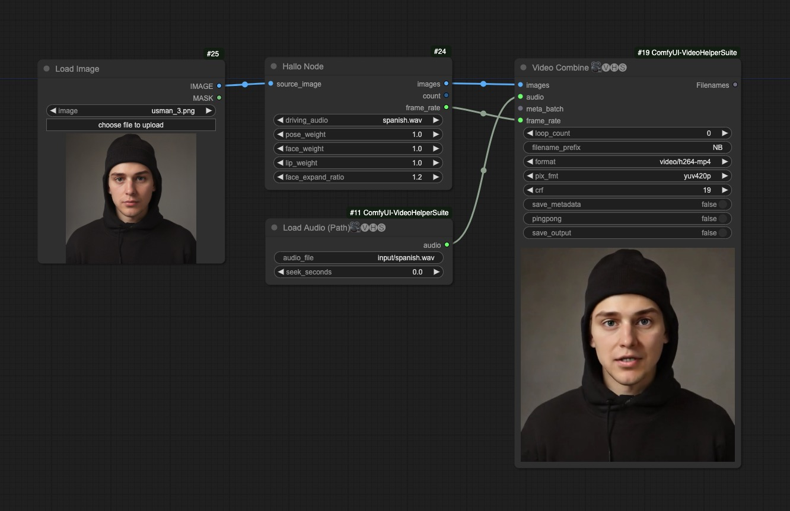

# ComfyUI Hallo (Unofficial Support)

Unofficial [Hallo](https://github.com/fudan-generative-vision/hallo) support for [ComfyUI](https://github.com/comfyanonymous/ComfyUI).

## Important Updates
- **2024/06/26:** Added ComfyUI nodes and workflow examples

## Example Workflow
This [workflow](examples/hallo_comfyui_basic.json) shows the example usage on making an image into a talking face video.

 

## Installation
- Install from ComfyUI Manager (search for `hallo`, make sure `ffmpeg` is installed)

- Download or git clone this repository into the ComfyUI/custom_nodes/ directory and run:
```
sudo apt install ffmpeg
pip install -r requirements.txt

## insatll xformers match your torch, for torch==2.1.0+cu121
pip install xformers==0.0.22.post7
```

## Download Checkpoints
All models will be downloaded automatically to ComfyUI's model folder, just no wrries.
